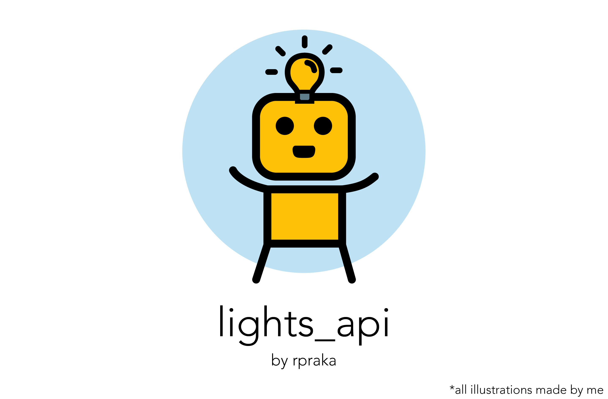

<!-- Logo -->
<br />
<p align="center">
  <a href="https://github.com/rpraka/lightsapi">
    
  </a>

  <h3 align="center">An extensible API for custom IoT light systems.</h3>

  <p align="center">
    <a href="https://github.com/rpraka/lightsapi">View Demo</a>
    ·
    <a href="https://github.com/rpraka/lightsapi/issues">Report Bug</a>
    ·
    <a href="https://github.com/rpraka/lightsapi/issues">Request Feature</a>
  </p>
</p>

<!-- ABOUT THE PROJECT -->
## About The Project

This project provides a simple REST API server and multiple REST client implementations for IoT light system control. Compared to websockets or MQTT, such an architecture uniquely allows **huge diversity for the type of clients allowed**. The endpoints can be manipulated via **Siri shortcuts, Google Home, Alexa, Chrome extensions and command line**, among others.

### Built With

* **PostgreSQL** - backend database
* **Python/Flask** - RESTful handler
* **IFTTT** - Intermediate webhook handler for Google Home and Alexa clients
* **NodeMCU ESP8266 WiFi SoC** - hardware implementation for servo control
* **C++** - ESP8266 client implementation
* **Javascript** - Chrome extension client implementation


<!-- GETTING STARTED -->
## Getting Started


### Prerequisites
The hardware implementation requires a servo motor with least 2.5 kg-cm torque and a NodeMCU ESP8266 development board or similar (any WiFi-capable board should suffice but will require alteration to pinouts and WiFi connection code)


### Installation

1. Clone the repo
   ```sh
   git clone https://github.com/rpraka/lightsapi.git
   ```
2. Reserve a Heroku dyno or any other VPS instance. Deployment is easiest with Heroku as all required files have been provided. Attach a postgreSQL instance.
3. Set the following parameters in the code as desired:
   1. WIFI SSID and password
   2. Device ids and authkeys
   3. Base url endpoint of the VPS server
4. Deploy the server code to the VPS
5. Install hardware implementation
6. Enable your choice of client implementations

<!-- USAGE EXAMPLES -->
## Usage


<!-- ROADMAP -->
## Roadmap
### Upgrades
* Could add more advanced auth features, but is likely just uneccessary overhead in this case.
* Considered websocket rather than REST, but probably is overkill for an ESP8266. MQTT might be a better choice, but is harder to interface with commercial smart home devices.

<!-- CONTRIBUTING -->
## Contributing

Any contributions are greatly appreciated.

1. Fork the Project
2. Create a Feature Branch (`git checkout -b feature/example_feature`)
3. Commit your Changes (`git commit -m 'Added example_feature'`)
4. Push to the Branch (`git push origin feature/example_feature`)
5. Open a Pull Request


<!-- LICENSE -->
## License

Distributed under the MIT License.


<!-- ACKNOWLEDGEMENTS -->
## Acknowledgements

* See in-line comments


